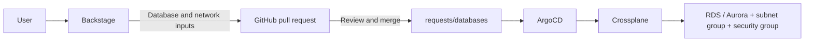

# Backstage database portal on EKS

Deploy Backstage with Argo CD and provision **RDS PostgreSQL** or **Aurora PostgreSQL** with your existing Crossplane installation.

For the GitHub Actions image build, ECR publishing, Cilium ingress and automatic Cloudflare DNS, follow [the image workflow guide](docs/image-workflow.md).



The templates accept an existing VPC, two or more private subnet IDs, and a client security group. They create a database subnet group and a dedicated security group allowing PostgreSQL from that client group. They do not create VPCs/subnets or query AWS for dropdown choices. RDS uses Multi-AZ; Aurora creates two instances. AWS chooses its default engine version; pin a supported `engineVersion` in the skeletons if your organization requires one.

This repository contains deployment configuration and templates, not Backstage application source. The included GitHub Actions workflow builds your existing application source repository after you add the GitHub scaffolder module described below. EKS, Argo CD, Crossplane, and the portal's own PostgreSQL database must already exist.

| Path | Purpose |
| --- | --- |
| `argocd/` | Project and four independently bootstrapped Applications |
| `platform/backstage/` | Deployment, Service, Cilium Ingress and generated configuration ConfigMap |
| `.github/workflows/backstage-image.yaml` | Build application source, publish to ECR and open a deployment PR |
| `platform/crossplane/` | AWS RDS/EC2 providers, IRSA runtime configuration and ProviderConfig |
| `catalog/` | Backstage templates and owning group |
| `requests/databases/` | Approved resource manifests watched recursively by Argo CD |
| `docs/aws/` | IAM trust and permissions policy examples |

## 1. Match the configuration to your cluster

The Git URL is `https://github.com/JohnMonteir0/idp-with-backstage.git`; deployment and PR targets use `main`. Merge this configuration to `main` before bootstrapping, or change **all** references to `main` in `argocd/applications`, `catalog/templates/*/template.yaml` and `platform/backstage/app-config.platform.yaml` to your chosen branch. Do not enable provisioning against an unreviewed development branch.

Replace the image/account placeholders:

```sh
rg -n 'REPLACE_|example.com|main' argocd platform catalog docs
```

Set the runtime IAM role ARN in both `platform/crossplane/providers/*-runtime.yaml`. Set your image in `platform/backstage/deployment.yaml`. Defaults are `argocd`, `crossplane-system`, and `backstage` namespaces; update application destinations, project destinations, IAM trust subjects and manifests if yours differ.

The community AWS providers are pinned to `v2.0.0` and use the cluster-scoped `*.aws.upbound.io` APIs. These APIs are also supported on Crossplane v2. Check your installed Crossplane version and package compatibility before adopting these packages:

```sh
kubectl -n crossplane-system get deployment crossplane -o jsonpath='{.spec.template.spec.containers[0].image}'
kubectl get providers.pkg.crossplane.io
kubectl get providerconfigs.aws.upbound.io
```

If your cluster already has RDS/EC2 providers or an `aws` ProviderConfig, reuse their names/configuration and remove conflicting definitions before syncing. Do not install a second provider that owns the same CRDs. This repository does not upgrade or reinstall Crossplane. A provider-family-aws dependency is installed by the package manager; wait for it too. On installations using managed resource activation policies, ensure the six CRDs in step 4 are activated.

## 2. Configure AWS access for Crossplane

Ensure your EKS OIDC provider is registered with IAM. Get the issuer:

```sh
aws eks describe-cluster --name YOUR_CLUSTER --region YOUR_REGION --query 'cluster.identity.oidc.issuer' --output text
```

In `docs/aws/trust-policy.json`, replace `REPLACE_ACCOUNT_ID` and every `REPLACE_OIDC_HOSTPATH` with the issuer **without `https://`**. The role trusts only the two provider service accounts. Crossplane creates these service accounts from DeploymentRuntimeConfig; do not create competing service account controllers.

```sh
aws iam create-role --role-name crossplane-databases --assume-role-policy-document file://docs/aws/trust-policy.json
aws iam put-role-policy --role-name crossplane-databases --policy-name database-provisioning --policy-document file://docs/aws/permissions-policy.json
```

The permissions example supports the resources generated here, including RDS-managed credentials. It uses wildcard resources for bootstrap simplicity; scope supported actions to your account, regions and resource naming policy before broader rollout. Customer-managed KMS keys require additional key permissions and key policies. Providers need connectivity to AWS APIs/STS and package registries.

## 3. Prepare Backstage

In your **Backstage application's source repository**, install the GitHub action module:

```sh
yarn --cwd packages/backend add @backstage/plugin-scaffolder-backend-module-github
```

In `packages/backend/src/index.ts`, keep your existing catalog/scaffolder registrations and add:

```ts
backend.add(import('@backstage/plugin-scaffolder-backend-module-github'));
```

Use a module version compatible with your Backstage release. Confirm `fetch:template` and `publish:github:pull-request` appear at `/create/actions`. Use the [included image workflow](docs/image-workflow.md) to build and publish the image and propose a Deployment update. The supplied command assumes the standard `/app` working directory and `packages/backend` bundle. Adjust it for your image.

Keep your existing production sign-in provider, catalog identity resolution, and permission configuration in `app-config.production.yaml` inside the image. Supply any authentication environment variables it needs in the Secret below. There is no guest authentication configuration here. Restrict template execution through your existing permission policy and protect `main` with required reviews; the GitHub token can write to the repository.

The overlay config registers the template catalog and GitHub integration. A fine-grained token needs this repository's **Contents: read/write**, **Pull requests: read/write**, and metadata access. The token is server-side; it is not an AWS credential. You can replace it with your existing GitHub App integration. Preserve other catalog locations/integrations when merging the overlay: configuration arrays can replace existing arrays.

Reuse the portal's existing PostgreSQL database and credentials. The default overlay verifies TLS using `/app/certs/global-bundle.pem`; include the [AWS RDS CA bundle](https://truststore.pki.rds.amazonaws.com/global/global-bundle.pem) in your image at that path, or adapt the TLS/CA configuration to your existing database. The Backstage DB user must retain its existing plugin database/schema creation privileges. Portal storage is independent of the databases requested through the templates.

Create `backstage-secrets` without committing credentials:

```sh
kubectl create namespace backstage --dry-run=client -o yaml | kubectl apply -f -
cp docs/backstage-secrets.env.example /tmp/backstage-secrets.env
chmod 600 /tmp/backstage-secrets.env
# Edit /tmp/backstage-secrets.env with your real values and existing auth variables.
kubectl -n backstage create secret generic backstage-secrets --from-env-file=/tmp/backstage-secrets.env --dry-run=client -o yaml | kubectl apply -f -
rm /tmp/backstage-secrets.env
```

If Backstage already exists, compare its Deployment name, immutable selector, namespace, Service ports, ingress and configuration first. Match these manifests to it before Argo adoption. Do not let Helm/another Argo application reconcile the same objects. Transfer ownership using your existing deployment process without uninstalling the running application or deleting its database. If your image runs under a different UID, update the pod security context.

The Service is internal to Kubernetes and the included Cilium Ingress exposes it through your existing shared ingress load balancer. Follow [the Cilium/TLS/ExternalDNS setup](docs/image-workflow.md) before syncing: create the TLS secret, configure the hostname, and ensure ExternalDNS watches Ingress resources. The image workflow updates the hostname and `BACKSTAGE_BASE_URL` together. The explicit URL in the Deployment takes precedence over the Secret's URL. Preserve your existing sign-in configuration and update its callback URLs. Restart the Deployment after changing secrets; ConfigMap changes trigger rollout automatically through Kustomize's hash.

## 4. Connect the repository to Argo CD and bootstrap

Log in to your existing Argo CD. If the repository is public, no repository credential is needed. For a private repo, add it in **Settings → Repositories → Connect Repo** using the exact HTTPS URL above and a read-only credential. Alternatively use a GitHub App:

```sh
argocd repo add https://github.com/JohnMonteir0/idp-with-backstage.git \
  --github-app-id YOUR_APP_ID \
  --github-app-installation-id YOUR_INSTALLATION_ID \
  --github-app-private-key-path /secure/path/github-app.pem
```

The Argo credential is separate from Backstage's write credential. Argo must have cluster permissions to apply the resources permitted by `argocd/project.yaml`; an AppProject allowlist does not grant Kubernetes RBAC.

Apply the project, then bootstrap providers first:

```sh
kubectl apply -f argocd/project.yaml
kubectl apply -f argocd/applications/crossplane-providers.yaml
argocd app sync crossplane-providers
kubectl wait --for=condition=Healthy provider.pkg.crossplane.io/provider-aws-rds provider.pkg.crossplane.io/provider-aws-ec2 --timeout=600s
kubectl get providers.pkg.crossplane.io
kubectl wait --for=condition=Established crd/providerconfigs.aws.upbound.io crd/instances.rds.aws.upbound.io crd/clusters.rds.aws.upbound.io crd/clusterinstances.rds.aws.upbound.io crd/subnetgroups.rds.aws.upbound.io crd/securitygroups.ec2.aws.upbound.io crd/securitygrouprules.ec2.aws.upbound.io --timeout=300s
```

Confirm the automatically installed family provider is Healthy before proceeding. Then:

```sh
kubectl apply -f argocd/applications/crossplane-config.yaml
argocd app sync crossplane-config
kubectl get providerconfig.aws.upbound.io aws
kubectl apply -f argocd/applications/database-requests.yaml
kubectl apply -f argocd/applications/backstage.yaml
argocd app sync database-requests
argocd app sync backstage
kubectl -n backstage rollout status deployment/backstage --timeout=300s
```

These Applications enable **automated sync and self-healing**, with pruning disabled. Initial ordering is explicit: Argo sync waves across independent Applications do not establish dependencies. Subsequent merges automatically update the relevant resources. Changes to the Application definitions or project themselves need `kubectl apply` again; they are the bootstrap layer, not watched by a parent Application.

For UI-only creation, create project `idp` from the supplied project manifest and create an Application for each manifest's name/path, revision `main`, destination `https://kubernetes.default.svc`, and namespace. Enable auto-sync, self-heal, create namespace and server-side apply; leave prune off. Follow the same provider-first order.

## 5. Request and verify a database

Open **Create** in Backstage and select RDS PostgreSQL or Aurora PostgreSQL. Enter a unique resource name, region, class, VPC, private subnet IDs and allowed client security group. The initial PostgreSQL database name must not be a reserved database name such as `postgres`, `template0` or `template1`.

Network fields are validated for ID shape, not against AWS inventory. Before merging, verify all subnets and the client security group belong to the selected VPC/region, at least two availability zones are present, the subnets are private, and your application network can reach them. Verify the selected instance class is available for the engine/region. For pod security groups use the pod SG; otherwise use the relevant node/application SG.

The result link opens a pull request. Review and merge it. Argo watches all request directories automatically; there is no central resource list to edit. A successful Backstage task means **PR created**, and an Argo `Synced` result means manifests applied. Neither proves the database is ready:

```sh
kubectl get managed -l platform.example.org/database=YOUR_DATABASE_NAME
kubectl describe instance.rds.aws.upbound.io YOUR_DATABASE_NAME
# For Aurora:
kubectl describe cluster.rds.aws.upbound.io YOUR_DATABASE_NAME
kubectl get clusterinstances.rds.aws.upbound.io
```

Wait for `Ready=True` and `Synced=True` on the database and every Aurora instance. Provisioning can take many minutes. Endpoints and master secret metadata are available in resource `status.atProvider` and the AWS RDS console. AWS generates and rotates the master password in Secrets Manager. Grant an application its own appropriate DB account and secret access; the portal never stores the generated password in Git. No catalog database status plugin is bundled here.

## Operations and validation

Encryption, seven-day backups, private access and deletion protection are enabled. Aurora runs two billable instances and RDS uses Multi-AZ. `deletionPolicy: Orphan` plus Argo prune/delete protections retain AWS resources when manifests disappear. Removing a request directory **does not decommission its database**. To decommission, first approve a change disabling AWS deletion protection, setting a unique final snapshot identifier and changing deletionPolicy to `Delete`; sync and verify it, then explicitly delete the managed database objects (Aurora instances before cluster), and finally network objects. Keep controller/IAM access until completion. Account for final snapshots and Secrets Manager lifecycle. Orphaning resources permanently requires an AWS-side cleanup or explicit re-import plan.

Backstage has no Kubernetes service account token or AWS permissions. Database resources are cluster-scoped, so isolate tenants using reviewed Git changes and platform RBAC; this is not a per-namespace tenant isolation system.

Local checks:

```sh
kubectl kustomize platform/backstage > /tmp/backstage-rendered.yaml
npm install --prefix /tmp/idp-validation --no-audit --no-fund nunjucks@3.2.4 yaml@2.8.1 ajv@8.17.1
NODE_PATH=/tmp/idp-validation/node_modules node scripts/validate.cjs
```

The validator renders both templates using Nunjucks and checks cross-resource references and public-access/password safeguards. With `--schemas /path/to/crds`, it also validates against the provider's CRDs (download the six cluster-scoped CRDs from the pinned provider release into that directory). Kubernetes server-side dry runs against your cluster and a real request are still required to verify admission, IAM, network placement and AWS availability. No AWS or cluster changes are made by local validation.

Implementation references: [Backstage Kubernetes deployment](https://backstage.io/docs/deployment/k8s/), [GitHub scaffolder module](https://backstage.io/docs/features/software-templates/builtin-actions/), [community AWS provider v2.0.0](https://github.com/crossplane-contrib/provider-upjet-aws/releases/tag/v2.0.0), [EKS IRSA](https://docs.aws.amazon.com/eks/latest/userguide/associate-service-account-role.html), [RDS managed passwords](https://docs.aws.amazon.com/AmazonRDS/latest/UserGuide/rds-secrets-manager.html), and [Argo CD sync ordering](https://argo-cd.readthedocs.io/en/latest/user-guide/sync-waves/).
